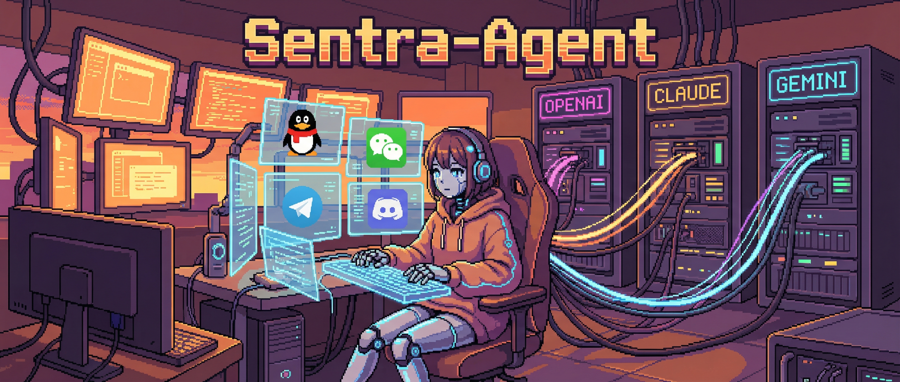
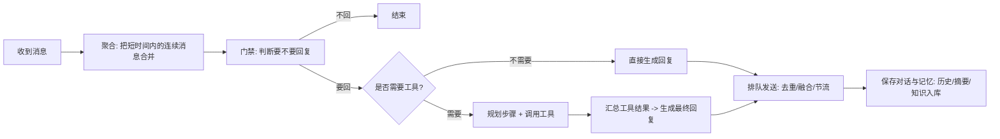
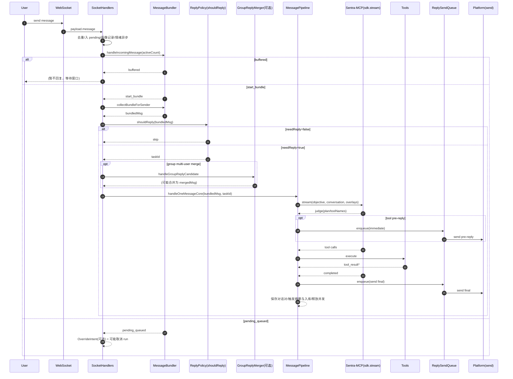
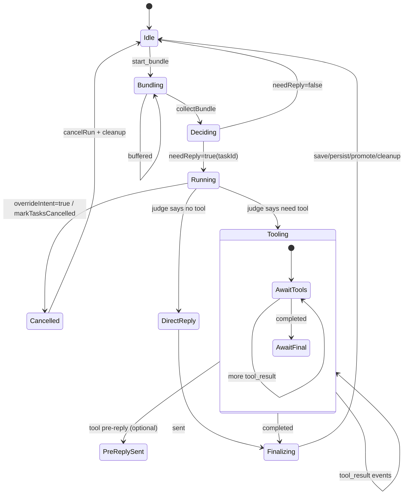
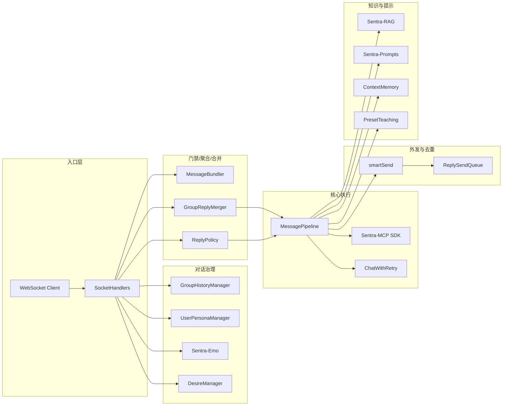

# Sentra Agent



一个为生产环境设计的全栈 AI Agent 框架。以“协议优先”和“可控可观测”为核心，把对话、工具调用、结构化输出与多平台适配打通，适用于长期在线、多人群聊、复杂工具链的真实业务场景。

[](LICENSE)
[](https://nodejs.org/)
[](https://pm2.keymetrics.io/)
[](https://redis.io/)
[](https://www.python.org/)

## 目录

- [定位与理念](#定位与理念)
- [核心优势](#核心优势)
- [Sentra-MCP：模型无关的工具层](#sentra-mcp模型无关的工具层)
- [模块优势一览](#模块优势一览)
- [典型应用场景](#典型应用场景)
- [与常见 Agent 框架对比](#与常见-agent-框架对比)
- [架构](#架构)
- [一次任务的完整执行流程](#一次任务的完整执行流程端到端)
- [配置与文档索引](#配置与文档索引)
- [贡献](#贡献)
- [许可证](#许可证)

## 定位与理念

Sentra Agent 面向的是“要长期稳定跑起来”的 Agent，而不是一次性 Demo。

我们把工程里最容易失控的部分（输出不可控、工具边界不清、群聊并发混线、失败难收敛、上线后难排障）前置到框架层解决：

- **把模型能力“解耦成可替换部件”**：换模型不应该意味着重写一套工具调用与格式化体系。
- **把工具调用“工程化”**：可观测、可回放、可降级，尽量避免一次异常引发整条链路崩溃。
- **把群聊当作一等场景**：并发、隔离、取消、去重、冷却、合并等，都要有明确策略。

## 核心优势

- **模型无关的“可控输出层”**
  - 不依赖模型天然具备某种特定结构化能力，而是在框架层提供统一的输出约束、预处理、校验与重试。
  - 目标是减少“模型说得很好，但系统无法稳定解析/执行”的工程成本。

- **Sentra-MCP：面向任何模型的工具兼容层**
  - 你不需要为不同模型维护多套工具调用实现（原生工具调用 / 文本结构化回退 / 严格 JSON 等）。
  - 同一套工具体系可以在不同模型间迁移，并保持一致的执行、回填与可观测行为。

- **生产级对话治理（尤其群聊）**
  - 并发隔离、任务取消与清理、消息去重、预回复冷却、批量合并回复等，都是为真实 IM 场景设计。
  - 你可以把 Agent 当成一个长期在线的“服务”，而不是一次性脚本。

- **多阶段决策引擎**
  - 把“要不要用工具”“怎么规划步骤”“参数如何补全”“结果是否可信”“最终怎么说给用户听”拆开处理。
  - 让复杂任务能收敛，且每一段都有可观测边界。

- **模块化全栈能力（按需启用）**
  - 工具生态、提示词体系、RAG、情绪分析、配置 UI 都是独立板块。
  - 你可以只拿其中一部分能力集成到现有系统，不必全量使用。

## Sentra-MCP：模型无关的工具层

Sentra-MCP 不是“必须要求模型理解某个协议”的方案，而是把工具调用做成一个**可移植的工程层**：

- 你可以选择任何模型作为主对话模型。
- 模型只需要能输出文本，框架就可以把它约束到“可执行的工具调用与可发送的最终回复”。
- 工具调用的生成、执行、结果回填与后续表达，都有统一的治理方式。

### Sentra-MCP 解决的不是“能不能调用工具”，而是“能不能稳定跑”

在生产里，真正难的往往不是“调用某个工具”，而是：

- 工具链变长后，如何**保证每一步都有边界**（超时、重试、降级、取消）。
- 多人群聊并发时，如何**保证上下文不串**（同群不同人的临时上下文隔离、结束后再合并）。
- 模型输出偶发波动时，如何**把错误收敛在框架层**（预处理、校验、重试、修复、回退策略）。

Sentra-MCP 的价值就在于把这些“工程难题”统一封装，让你扩展工具、替换模型、扩大并发时仍然能稳。

### 为什么需要 Sentra-MCP

很多 Agent 项目在早期会看起来很好用，但一旦进入生产，会遇到一些反复出现的现实问题：

- **换模型就要重写工具层**：有的模型擅长 FC、有的擅长文本、有的 JSON 不稳定。
- **结构化输出飘逸**：偶发多输出一句、漏字段、加了 markdown fence，导致解析失败和大量重试。
- **工具结果难以回填可控**：上下文里混入噪音，越跑越不稳定，排障也困难。

Sentra-MCP 的目标不是追求“最炫”，而是追求“可控、可迁移、可排障”。

### Sentra-MCP 的关键能力（面向工程）

- **模型能力解耦**
  - 不要求模型原生支持 MCP。
  - 不要求必须使用某一种原生工具调用形态。
  - 也不把系统绑定到某一种 JSON 格式化方式。

- **统一执行与回填**
  - 工具调用与结果回填都走统一通路，降低上下文污染。
  - 支持多工具串联与批量回填，便于复杂任务收敛。

- **稳定性策略**
  - 对输出做预处理、严格校验与可控重试，减少“偶发格式问题”带来的不可用。
  - 必要时可以降级回本地策略，避免因为一次模型输出异常导致整轮失败。

- **可观测与可回放**
  - 工具调用与结果是结构化的，可记录、可追踪、可复现。
  - 适合接入监控、日志平台与故障排查流程。

### 适合哪些团队/项目

- **你要经常换模型或多模型混用**：希望成本/速度/质量随时可切，但行为仍然稳定。
- **你要长期运行**：机器人 24/7 在线，偶发错误必须能自愈或降级。
- **你要做复杂工具链**：多步骤、跨系统、需要重试/回滚/取消。
- **你要做群聊机器人**：并发与隔离是第一需求，而不是附加功能。

### 你会得到什么

当你把工具层交给 Sentra-MCP：

- 更容易在不同模型之间迁移与对比效果（成本/速度/质量）。
- 更容易扩展工具生态（新增工具不需要改变整体协议策略）。
- 更容易在线上稳定跑（失败有边界、能重试、能降级、能定位）。

## 模块优势一览

### sentra-mcp

- **工具生态统一入口**：让“工具调用”成为可管理、可扩展的工程能力。
- **模型无关**：同一套工具体系可以在不同模型间复用。
- **工程化治理**：可观测、可回放、可降级，适合长期运行。

你可以把 `sentra-mcp` 当成一个 SDK 使用：一次 run 或按事件流消费（便于接 UI、日志与监控），这对“要做成产品”非常关键。

### sentra-prompts

- **提示词体系化管理**：把关键提示与策略沉淀成可版本化的资产。
- **协议与策略统一**：避免不同模块各写各的提示词，导致行为分裂。
- **便于灰度与对比**：同一策略可在不同模型之间对照验证。

在工程上，`sentra-prompts` 的优势是：提示词不是散落在代码里的字符串，而是可组合、可映射、可复用的“配置资产”，适合做多环境、多平台、多角色的提示词治理。

### sentra-rag

- **合约驱动的入库与查询**：把“要抽取什么字段、怎么落图、怎么检索”固化为可迭代的合约策略，降低 RAG 工程复杂度。
- **Neo4j 图谱检索 + 混合检索**：支持向量检索、全文检索与混合策略，并提供上下文拼接与去重。
- **可选 rerank**：可在候选片段较多时做二阶段重排，提升命中质量。
- **可观测与可调参**：预算、topK、是否扩展父节点、是否启用 rerank 等都可配置，便于线上调优。

### sentra-emo

- **情绪识别与语气控制**：让回复更像“在跟人聊天”，而不是一律同一种口吻。
- **适合社交场景**：尤其在群聊里，风格与分寸很重要。

`sentra-emo` 兼顾两点：一是模型离线可用（减少外部依赖），二是把情绪输出做成可解释的连续维度（例如 VAD/PAD 与压力），更利于你把它接入回复策略与用户画像。

### sentra-config-ui

- **配置不再靠背命令**：把多环境变量、多模块开关变成可视化管理。
- **面向部署/运维**：更适合团队协作与持续迭代。

如果你要把 Sentra 当作长期运行的服务交给别人维护，Config UI 能显著降低“配置靠口口相传”的风险。

### 核心运行时（Main.js / utils / src/agent）

- **阶段化执行**：将复杂任务拆分为可观测的阶段与边界。
- **对话治理**：历史管理、群聊隔离、去重、冷却与取消等能力收敛在核心层。
- **稳定性优先**：在“能用”与“稳定可控”之间选择后者。

这部分是 Sentra 的“底盘”：哪怕你只把 Sentra-MCP 当 SDK 用，最终也会受益于这里沉淀的治理策略。

## 典型应用场景

- **企业内部助手**：多系统工具接入、权限与审计、稳定性要求高。
- **群聊机器人**：并发、隔离、去重、冷却、合并回复、上下文不混线。
- **工具链自动化**：多工具串联执行、可回放、可追踪。
- **知识型问答/RAG**：从“只会聊天”升级到“能基于资料可靠回答”。
- **多模型策略**：不同阶段使用不同模型（成本/质量/速度权衡）。

## 与常见 Agent 框架对比

| 维度 | Sentra Agent | 常见 Agent 框架/脚手架 |
|---|---|---|
| 模型兼容性 | 模型无关（文本即可），工具层与执行策略可复用 | 往往依赖特定能力：原生 FC / 原生 MCP / 严格 JSON |
| 工具体系 | Sentra-MCP：统一入口、统一回填、工程化治理 | 多种协议并存，迁移成本高 |
| 输出稳定性 | 预处理 + 严格校验 + 可控重试/降级 | 依赖模型自觉，异常时难收敛 |
| 群聊能力 | 并发/隔离/取消/冷却/合并等均有策略 | 常偏单人对话或弱治理 |
| 可观测性 | 阶段边界清晰，工具链路可追踪可回放 | 逻辑耦合，排障成本高 |

## 架构

这不是一套“把所有东西堆到一起”的脚手架，而是按职责拆分的多板块体系：核心运行时负责对话与治理，Sentra-MCP 负责工具生态，RAG/情绪/提示词/配置 UI 作为可插拔能力。

### 项目结构

```
sentra-agent/
├── Main.js                      # 主入口
├── agent.js                     # Agent 核心
├── src/
│   ├── agent/                   # Agent 逻辑（Judge、Plan、ArgGen、Eval、Summary）
│   ├── config/                  # 配置管理
│   └── utils/                   # 工具函数
├── utils/                       # 核心工具
│   ├── replyPolicy.js           # 智能回复策略
│   ├── userPersonaManager.js    # 用户画像管理
│   ├── groupHistoryManager.js   # 群聊历史管理
│   └── messageCache.js          # 消息缓存
├── sentra-mcp/                  # MCP 工具生态
├── sentra-rag/                  # RAG 知识检索
├── sentra-prompts/              # 提示词管理
├── sentra-emo/                  # 情绪分析服务
├── sentra-config-ui/            # 配置管理界面
├── docs/                        # 文档
└── ecosystem.config.cjs         # PM2 配置
```

## 一次任务的完整执行流程（端到端）

这一节不是“概念图”，而是基于当前代码（`Main.js` / `components/SocketHandlers.js` / `components/MessagePipeline.js` / `utils/replyPolicy.js` / `utils/messageBundler.js` / `utils/replySendQueue.js`）整理出的**真实执行链路**。

> 如果你在本地预览里只看到“代码块”，没有看到图：这是因为你的 Markdown 预览器未启用 Mermaid 渲染。
> 在 GitHub 网页上通常会直接渲染；本地需要 IDE/插件支持 Mermaid。

你可以把一次“任务”的粒度理解为：

- **私聊**：基本每条消息都会进入完整流程。
- **群聊**：通常会经过聚合与门禁，满足条件才进入完整流程。

### 0) 先用“小白能懂”的方式理解：这套系统在管什么？

你可以把 Sentra 的运行理解成 3 个层次（从“人话”到“工程”逐渐变细）：

- **对话层（你看到的）**：你发一句话，机器人决定要不要回、回什么。
- **任务层（系统在做的事）**：一次“要完成的目标”，可能需要工具、可能需要多步骤。
- **运行层（执行实例）**：任务真正开始跑起来后的那次执行过程（可取消、可追踪）。

简单类比：

- 对话像“一个聊天窗口”。
- 任务像“你这次让机器人帮你做的事”。
- 运行像“这件事开始干活后的那趟流水线”。

<details>
<summary>高级细节（实现层标识，默认不看也完全不影响理解）</summary>

- **conversationKey（路由维度）**：
  - 群：`G:{group_id}`
  - 私聊：`U:{sender_id}`
- **conversationId（并发维度）**：
  - 群：`group_{group_id}_sender_{sender_id}`（同群不同人强隔离）
  - 私聊：`private_{sender_id}`
- **taskId**：回复决策通过后创建，用于并发槽位/取消/队列。
- **runId**：MCP 运行实例 ID，用于取消与追踪。

</details>

### 1) 一句话到“发出去”的大流程

你可以先记住一句话：

> **先把消息“攒一攒”，再决定“回不回”，需要的话“用工具办事”，最后把结果“说人话并排队发出去”，再把这一轮“记到历史里”。**



### 2) 典型时序图（群聊：有聚合、有门禁、有工具）



### 3) 任务生命周期状态机（并发/取消/吞吐/延迟任务）



### 4) 组件关系图（把“职责边界”画清楚）



### 5) “群聊为什么不串线”：隔离策略的核心点

- **并发隔离**：群聊按 `group + sender` 维度形成独立 `conversationId`，避免同群多人并发时共享同一条“任务上下文”。
- **历史隔离（scoped）**：在群聊里，某些中间过程（例如工具预回复、处理中间态）会先进入 sender-scoped 临时历史，任务确认落库后再统一 promote，避免污染其他人上下文。
- **取消精准化**：改意愿触发时，只取消“该 sender + 该会话”下的运行，避免误伤同群其他人的任务。

## 配置与文档索引

本项目的配置较多，推荐通过 Config UI 进行可视化管理。所有配置项与默认值请参考：

- `.env.example`

更多模块文档：

- [Sentra MCP](sentra-mcp/README.md) - 工具生态与协议说明
- [Sentra RAG](sentra-rag/README.md) - 知识检索
- [Sentra Prompts](sentra-prompts/README.md) - 提示词/协议模板
- [Sentra Emo](sentra-emo/README.md) - 情绪分析
- [协议与数据流](PROTOCOL.md) - 协议理念与数据流说明

## 贡献

我们欢迎社区贡献！

### 提交 Issue

在 [GitHub Issues](https://github.com/JustForSO/Sentra-Agent/issues) 提交问题时，请提供：
- 清晰的标题
- 详细的描述
- 复现步骤
- 预期行为和实际行为
- 环境信息

### 贡献方向

欢迎贡献：
- Bug 修复
- 新功能
- 文档改进
- 测试用例
- 新的 MCP 工具
- 新的平台适配
- 性能优化

## 许可证

本项目采用 [Non-Commercial License](LICENSE) 协议，**明确禁止商业化使用**。

---